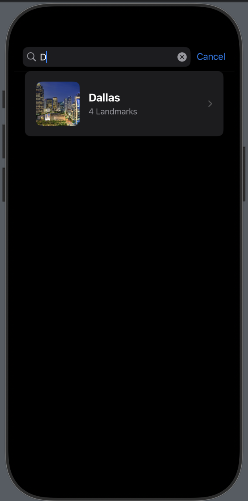

# WhatsNext – iOS (SwiftUI)


**WhatsNext** is a SwiftUI iOS app that lets users browse cities, explore famous landmarks, and view upcoming events. It’s **Dark Mode ready** and designed with a clean, modern UI.

---

## Demo

| Home  | Search Bar | No Results | City Details |
|--------------|-------------|-------------|-------------|
|  |  |  | 

---

##  Features

- **Search** cities by name
- **City detail view** with image
- **Landmarks** displayed in a horizontal scrollable view
- **Events** in a two-column grid layout
- **Dark Mode** support with adaptive system colors

---

## Roadmap

Planned future updates:
- Live events from a public API (Ticketmaster / Eventbrite)
- Location-based sorting (nearest cities first)
- Favorites with persistence (UserDefaults / Core Data)
- MapKit integration for event locations
- Pull-to-refresh & offline caching

---

## Tech Stack

- Swift 5.x, **SwiftUI**, NavigationStack
- Adaptive system colors for Light/Dark mode
- Target: iOS 17+

---

## Getting Started

1. **Clone the repo**
   ```bash
   git clone https://github.com/AllanConstanza/WhatsNext-iOS.git
   cd WhatsNext-iOS
   
2. **Open in Xcode**

- Open WhatsNext - IOS.xcodeproj in Xcode.
- Copy Secrets.example.plist to Secrets.plist.
- Open Secrets.plist and set:
TM_API_KEY = your real Ticketmaster key

- In Xcode, select Secrets.plist and ensure Target Membership is checked for the app target.

3. **Run**

Select an iPhone simulator (iPhone 15 recommended) and press Run.

    
   **Notes:**

Secrets.plist is ignored by Git; only the example file is committed.

If you see “Missing TM_API_KEY”, make sure Secrets.plist exists and is part of the
app target (File Inspector → Target Membership).


